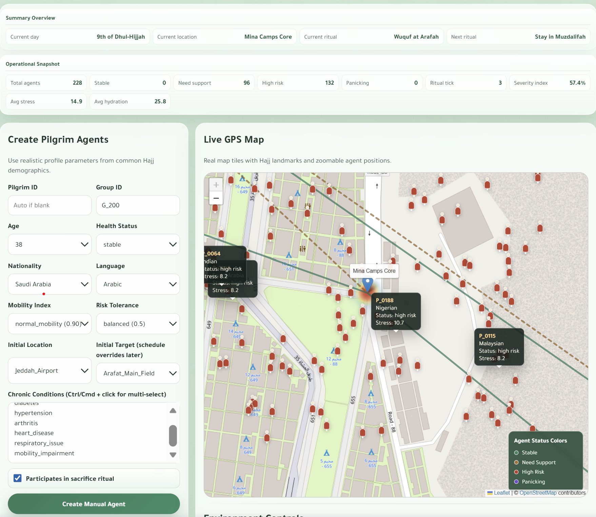
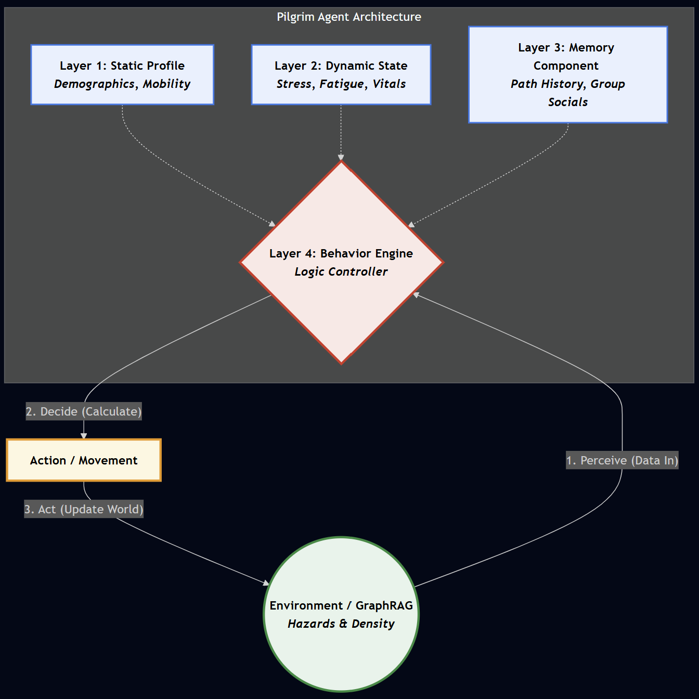

# 🕋 HajjSim Agent Studio


**HajjSim Agent Studio** is a predictive digital twin simulation platform utilizing Multi-Agent Swarm Intelligence to model pilgrim movement, stress, and crowd-risk conditions across Hajj locations. 

Current crowd management is heavily reactive; HajjSim aims to make it **proactive**. By simulating the behavior of millions of pilgrims under varying environmental pressures and a rigid spatial-temporal ritual schedule, this system allows operators to anticipate bottlenecks, density waves, and panic cascades before they occur in the real world.

## 📸 Dashboard Preview



## ✨ Core Features
* **4-Layer Agent Anatomy:** Pilgrim agents operate with distinct cognitive profiles: Static (DNA), Dynamic (Vitals), Memory, and a Behavior Engine (*Perceive → Decide → Act* loop).
* **Ritual Progression Logic:** Agents navigate a spatial-temporal graph governed by an event-driven, macro-temporal tick engine. 1 tick = 1 distinct ritual stage.
* **Live GPS & Heatmapping:** Real-time visualization of crowd movement and density stress using Leaflet.js.
* **Adversarial Testing:** Ability to dynamically inject environmental hazards (e.g., blocked gates, dropped luggage) to test swarm resilience.
* **Operational Analytics:** Live charting of the overall "Severity Index" and individual agent roster inspection.

## 🏗️ Technical Architecture
* **Backend:** Python HTTP server (`app.py`) running an event-driven simulation engine (`hajj_agents.py`).
* **Frontend:** Interactive Single-Page Application (SPA) built with Vanilla JavaScript, HTML5, and CSS3.
* **Libraries:** Leaflet.js, Leaflet.heat, Chart.js.
* **Data Storage:** JSON-based state management (`pilgrims.json`).



## 🚀 Quick Start

1. **Clone the repository:**
   ```bash
   git clone [https://github.com/yourusername/HajjSim-Agent-Studio.git](https://github.com/yourusername/HajjSim-Agent-Studio.git)
   cd HajjSim-Agent-Studio