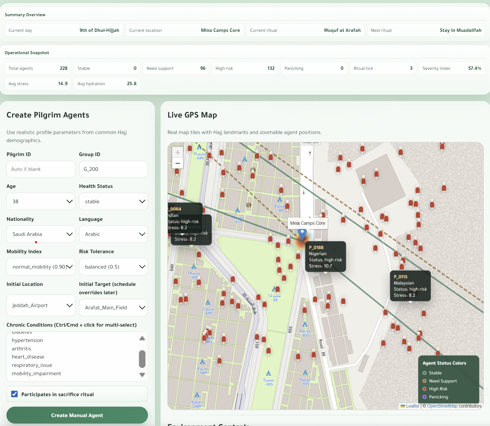
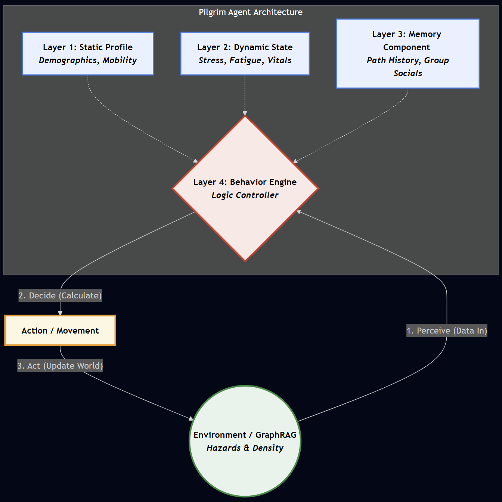

# 🕋 HajjSim Agent Studio


**HajjSim Agent Studio** is a predictive digital twin simulation platform utilizing Multi-Agent Swarm Intelligence to model pilgrim movement, stress, and crowd-risk conditions across Hajj locations. 

Current crowd management is heavily reactive; HajjSim aims to make it **proactive**. By simulating the behavior of millions of pilgrims under varying environmental pressures and a rigid spatial-temporal ritual schedule, this system allows operators to anticipate bottlenecks, density waves, and panic cascades before they occur in the real world.

## 📸 Dashboard Preview



## ✨ Core Features
* **4-Layer Agent Anatomy:** Pilgrim agents operate with distinct cognitive profiles: Static (DNA), Dynamic (Vitals), Memory, and a Behavior Engine (*Perceive → Decide → Act* loop).
* **Ritual Progression Logic:** Agents navigate a spatial-temporal graph governed by an event-driven, macro-temporal tick engine. 1 tick = 1 distinct ritual stage.
* **Live GPS & Heatmapping:** Real-time visualization of crowd movement and density stress using Leaflet.js.
* **LLM-Driven Decisions:** Pedestrian agents observe their surroundings (congestion, hazards, distances, risk) and ask a language model which of the engine's valid actions to take, with the rule-based ladder as a safe fallback.
* **Adversarial Testing:** Ability to dynamically inject environmental hazards (e.g., blocked gates, dropped luggage) to test swarm resilience.
* **Operational Analytics:** Live charting of the overall "Severity Index" and individual agent roster inspection.

## 🏗️ Technical Architecture
* **Backend:** Python HTTP server (`app.py`) running an event-driven simulation engine (`hajj_agents.py`).
* **Frontend:** Interactive Single-Page Application (SPA) built with Vanilla JavaScript, HTML5, and CSS3.
* **Libraries:** Leaflet.js, Leaflet.heat, Chart.js.
* **Data Storage:** JSON-based state management (`pilgrims.json`).



## 🚀 Quick Start

```bash
git clone https://github.com/Osvr7/HajjSim.git
cd HajjSim
python app.py
```

Then open <http://127.0.0.1:8000>. There are no third-party dependencies — the
backend is standard-library Python and the frontend is vanilla JS.

To drive the agents with a language model, set `LLM_API_KEY` first (next section).
Without it the simulation runs exactly as before, on the rule-based engine.

To run the terminal version instead:

```bash
python main.py
```

Type `step` to advance a tick, `generate 20` to add pilgrims, or a pilgrim ID to
inspect one.

---

## 🧠 LLM-Driven Pedestrian Decisions

Each pilgrim now **observes its environment and asks a language model what to do**
instead of only following a fixed rule ladder. The rule engine still runs first
every tick and its answer is handed to the model as the safe fallback, so a
missing key, a timeout, or a hallucinated action degrades to the original
behavior rather than breaking the run.

### Where the API key goes

**Only in an environment variable named `LLM_API_KEY`.** It is never read from a
source file, never written to disk, and never included in any API response, log
or report.

1. Copy the template and fill in your key:

   ```bash
   cp .env.example .env
   ```

   `.env` is git-ignored and **`app.py` loads it automatically at startup**.
   Nothing else is needed — `python app.py` will pick the key up.

   > ⚠️ Put the key in `.env`, never in `.env.example`. The `.example` file is
   > committed to the repository; a key placed there gets published.

2. Alternatively, export the variables in your shell. An exported value always
   takes precedence over `.env`, which is what you want for CI or a server.

   **Windows PowerShell**

   ```powershell
   $env:LLM_API_KEY = "your-key-here"
   $env:LLM_PROVIDER = "gemini"
   python app.py
   ```

   **Windows CMD**

   ```cmd
   set LLM_API_KEY=your-key-here
   set LLM_PROVIDER=gemini
   python app.py
   ```

   **macOS / Linux**

   ```bash
   export LLM_API_KEY="your-key-here"
   export LLM_PROVIDER="gemini"
   python app.py
   ```

On startup `app.py` prints exactly what it resolved, so a misconfigured key is
never silent:

```
HajjSim web app running at http://127.0.0.1:8000
Loaded 4 variable(s) from .env
LLM decisions ACTIVE -- provider=gemini model=gemini-flash-lite-latest driving=10 pilgrim(s)
```

The dashboard's **LLM Agent Intelligence** panel shows the same thing live, plus
the failure count and the last API error. If you set the key after starting the
server, `POST /api/llm/reload` re-reads it without a restart.

### Getting Gemini working (three things that will bite you)

**1. Send the key as a header, not a query parameter.** Google's current
"auth keys" (prefix `AQ.`, which is what AI Studio issues now) are rejected
with `401 UNAUTHENTICATED` if sent as `?key=` or as a bearer token. They must
go in the `x-goog-api-key` header. `GeminiProvider` does this — it is also
simply safer, since query strings land in proxy logs and headers do not.

**2. Model names are retired regularly.** `gemini-1.5-flash` no longer exists
and returns `404 NOT_FOUND`. Use a `-latest` alias so the config does not rot.
To see what your key can actually use:

```bash
python -c "import json,urllib.request;from llm_decision import load_env_file,LLMSettings;load_env_file('.env');r=urllib.request.Request('https://generativelanguage.googleapis.com/v1beta/models');r.add_header('x-goog-api-key',LLMSettings.from_env().api_key);print('
'.join(m['name'] for m in json.loads(urllib.request.urlopen(r).read())['models']))"
```

**3. The free tier is measured per minute.** One tick with 10 driven pilgrims
is 10 requests, which blows a single-digit-per-minute allowance immediately and
returns `429`. Set `LLM_MAX_REQUESTS_PER_MINUTE` to match your quota and keep
`LLM_MAX_AGENTS` small; the situation cache stretches the budget further.

A working free-tier `.env`:

```ini
LLM_API_KEY=your-key-here
LLM_PROVIDER=gemini
LLM_MODEL=gemini-flash-lite-latest
LLM_MAX_AGENTS=3
LLM_MAX_CALLS_PER_TICK=3
LLM_MAX_REQUESTS_PER_MINUTE=4
```

`gemini-flash-lite-latest` answers in ~1s, which matters when a run makes
thousands of small decisions.

### Which Google credential works

Use an **API key from Google AI Studio** — it starts with `AIza` and is sent as
`?key=`. A short-lived OAuth access token (starting `AQ.`) is sent as a bearer
token instead, but is generally **not** accepted by the Generative Language API
and returns `HTTP 401 UNAUTHENTICATED`. If every decision shows
`fallback_error`, check `last_error` in the status panel first.

### If the provider breaks, the run keeps moving

A failing provider used to be the worst case for *speed*: every pilgrim, every
tick, paid full network latency for a call that was going to fail anyway, which
made a run look frozen. Two things prevent that now:

* **Permanent errors are not retried.** A 401, a wrong model name or a malformed
  request will fail identically on a second attempt, so only genuinely
  retryable errors (429, 5xx, network/timeout) are retried.
* **A circuit breaker.** After `LLM_CIRCUIT_FAILURE_THRESHOLD` consecutive
  failures the engine stops calling out entirely and serves the rule-based
  decision instantly, re-probing once after the cooldown. One successful call
  closes it again.

Measured with a deliberately invalid key: steps went from ~4-5s each,
indefinitely, to 2.0s → 1.1s → **0.004s** once the breaker opened. The dashboard
shows an amber *"Calls paused after repeated failures"* badge while this is
happening, so a paused run is never mistaken for a broken one.

### Why a decision can still be rule-based

Even with a working key, these are all expected and visible in the decision log's
`source` field:

| `source` | Meaning |
| --- | --- |
| `llm` | The model chose it. |
| `cache` | An identical situation was already answered this run. |
| `disabled` | No key / `LLM_ENABLED=0` / unknown provider. |
| `fallback_error` | The API call failed — see `last_error`. |
| `fallback_invalid` | The model returned an unusable or out-of-set action. |
| `fallback_budget` | `LLM_MAX_CALLS_PER_TICK` was reached this tick. |
| `fallback_circuit_open` | The provider failed repeatedly, so calls are paused (see below). |
| `fallback_rate_limit` | `LLM_MAX_REQUESTS_PER_MINUTE` is spent for this minute. |
| `rule_based` | The pilgrim is not in the `LLM_MAX_AGENTS` sample, or is locked in transit (no real choice, so no call is made). |

### Configuring the LLM

| Variable | Default | What it does |
| --- | --- | --- |
| `LLM_API_KEY` | _(none)_ | **Required.** Your key/token. `GEMINI_API_KEY` is accepted as a fallback. |
| `LLM_PROVIDER` | `gemini` | `gemini`, `openai`, `anthropic`, or `echo` (offline test — no key, no network). |
| `LLM_MODEL` | per provider | e.g. `gemini-flash-lite-latest`, `gpt-4o-mini`, `claude-haiku-4-5-20251001`. |
| `LLM_BASE_URL` | _(vendor)_ | Override for a self-hosted or proxied endpoint. |
| `LLM_ENABLED` | `1` | Set to `0` to run the original rule-based agents. |
| `LLM_MAX_AGENTS` | `10` | How many pilgrims the model drives. `0` = the entire roster. |
| `LLM_DECISION_WORKERS` | `12` | How many decisions are made concurrently per tick. |
| `LLM_MAX_CALLS_PER_TICK` | `40` | Hard ceiling on live API calls per tick. `0` = unlimited. |
| `LLM_CACHE_ENABLED` | `1` | Reuse one answer across near-identical situations. |
| `LLM_TIMEOUT_SECONDS` | `12` | Per-call timeout. |
| `LLM_MAX_RETRIES` | `1` | Retries before falling back. Only applied to retryable errors (429, 5xx, network) — a 401 or a bad model name is never retried. |
| `LLM_CIRCUIT_FAILURE_THRESHOLD` | `5` | Consecutive failures before the engine stops calling the provider. `0` disables. |
| `LLM_CIRCUIT_COOLDOWN_SECONDS` | `60` | How long calls stay paused before one probe is retried. |
| `LLM_MAX_REQUESTS_PER_MINUTE` | `0` | Requests/minute ceiling, to stay inside a free tier. `0` = unlimited. |
| `LLM_TEMPERATURE` | `0.2` | Sampling temperature. |

> **Cost note.** A full run is ~240 ticks. With `LLM_MAX_AGENTS=0` and a large
> roster that means a very large number of API calls. Raise the caps deliberately.

### Getting 100% of decisions from the model

Set `LLM_MAX_AGENTS=0` and `LLM_MAX_CALLS_PER_TICK=0` and every pilgrim that has
a real choice to make will be decided by the model. Decisions within a tick run
**in parallel** (`LLM_DECISION_WORKERS`), so a tick costs roughly one model
latency rather than one per agent — measured with 12 agents against live Gemini:
**1.86s per tick, 100% model decisions**, where sequential would have been ~20s.

After that, the ceiling is your provider quota, not this code. The arithmetic
for a full 239-tick run:

| Roster | Decisions needed | vs. Gemini free tier (1,000/day) |
| ---: | ---: | --- |
| 3 agents | ~600 | fits in one day |
| 10 agents | ~2,000 | 2 days, or a paid tier |
| 43 agents | ~8,700 | 9 days, or a paid tier |

So on the free tier, "100% of a complete run" is realistic for a **small roster**
or a **short run**. With a bigger roster you get 100% until the daily quota runs
out, then clean rule-based fallback. Three things stretch it:

* **The situation cache.** Pilgrims in the same place, same risk band, same
  option set reuse one answer. Those decisions are logged as `cache` — still the
  model's reasoning, just not a second call for it.
* **`LLM_MAX_REQUESTS_PER_MINUTE`.** Paces calls inside the per-minute limit
  instead of collecting 429s.
* **Locked pilgrims are free.** Anyone in transit or queued for a bus has no
  real choice, so no call is made for them.

None of the fallbacks are failures — check the `source` field to tell a
quota-paced fallback (`fallback_rate_limit`) from a broken one (`fallback_error`).

### Trying it with no key at all

```bash
LLM_PROVIDER=echo LLM_MAX_AGENTS=0 python app.py
```

`echo` is an offline stand-in provider that makes no network call but exercises
every prompt-building, parsing, validation, logging and reporting path.

### How one decision is made

```
PilgrimAgent.step()
  -> perceive environment          (vitals, hazards, group)
  -> assess_risk()                 -> risk level / score / named factors
  -> BehaviorEngine.decide_action()
       -> _rule_based_decision()   -> the SAFE FALLBACK action
       -> llm_override(...)        -> app.llm_pilgrim_override()
            build_observation()    -> what the pilgrim can see
            available_actions()    -> what the engine can actually execute
            llm_decide_action()    -> structured prompt -> model -> JSON
                                   -> validate against available_actions
                                   -> on any failure: return the fallback
  -> _execute_action()             -> the world changes
  -> decision log records the outcome
```

The model must answer with JSON and may only pick a value that appears in the
supplied action list:

```json
{ "action": "AVOID_CROWD", "reason": "The current node is over capacity while the relief node is clear." }
```

Anything else — prose, a fenced block, an invented action, a timeout, an HTTP
error — is caught, the rule-based action is used instead, and the reason is
recorded in the log.

### What the model sees each step

The pilgrim's current location and zone; its current path and every connected
road; distance in hops to each candidate destination; whether a destination
requires a bus; live occupancy/capacity and a congestion label per node; the
active hazard with a plain-language description; the detected risk level with the
named factors that produced it; full vitals (stress, fatigue, hydration, panic);
group status; and the pilgrim's recent nodes, recent events and repeated visits.

### Available actions

The engine only ever offers actions it can genuinely execute, so a valid choice
can never be un-executable:

| Action | Meaning |
| --- | --- |
| `WAIT_FOR_RITUAL_WINDOW` | Stay in the current place. |
| `REST` | Stop and recover fatigue, stress and hydration. |
| `MOVE_TO_<ritual target>` | Continue on the planned route. |
| `MOVE_TO_<neighbour>` | Change to another connected road/location. |
| `AVOID_CROWD` | Divert to the designated lower-pressure relief node. |
| `MOVE_TO_<group node>` | Move to rejoin the group. |
| `STRAGGLE` | Break from the group on a short unplanned detour. |
| `ENTER_PANIC_MODE` | Emergency evacuation (offered only in genuine danger). |

When the convoy coordinator owns the pilgrim (`IN_TRANSIT`, or queued for a
corridor bus) there is no real choice, so no API call is made at all.

### Swapping in a different model

`llm_decision.py` is the only file that talks to a model. To add a backend:

```python
from llm_decision import BaseLLMProvider, register_provider

class MyProvider(BaseLLMProvider):
    name = "mine"

    def complete(self, system_prompt, user_prompt):
        return my_client.generate(system_prompt, user_prompt)  # raw text back

register_provider("mine", MyProvider)   # then set LLM_PROVIDER=mine
```

Nothing in the simulation, the logging, or the report needs to change.

### Logging and the automatic report

Every model decision and every significant risk is recorded as it happens in
`simulation_log.py`, so the report is built from what actually occurred rather
than from assumptions:

* **Decision log** — the environment seen, the options offered, the action
  chosen, the reason, the source (`llm` / `cache` / `fallback_*`), the latency,
  and the post-execution result (where the pilgrim ended up, how risk and vitals
  moved).
* **Risk events** — a lifecycle, not a point in time: opens when a pilgrim
  crosses into a high/severe risk band, collects every decision taken while it is
  open, and closes with an outcome verdict (`avoided`, `reduced`, `unchanged` or
  `worsened`).

When the run reaches **Hajj Complete** the six-section analytical report is
generated automatically and written to `reports/` as Markdown + JSON, alongside
the raw decision log. The dashboard renders the same report in the **LLM Agent
Intelligence** panel, and the *Generate LLM Simulation Report* button forces it
at any time.

Report sections: **1** Simulation overview · **2** Decision analysis (action
frequencies, important decision points, successful and unsuccessful examples) ·
**3** Risk analysis (when, where, cause, environment, decision, aftermath and
effectiveness for each event) · **4** Agent performance (risk avoidance,
consistency, response time, unnecessary vs. successful route changes, movement
efficiency, oscillation) · **5** Concrete improvement suggestions, each with the
evidence that produced it · **6** Final summary.

### API endpoints added

| Method | Endpoint | Purpose |
| --- | --- | --- |
| `GET` | `/api/llm/status` | Provider, model and live counters. Never returns the key. |
| `POST` | `/api/llm/reload` | Re-read `LLM_*` env vars without restarting. |
| `GET` | `/api/logs/decisions?limit=N` | Recent decision records. |
| `GET` | `/api/logs/risks` | All risk-event lifecycles. |
| `GET` | `/api/logs/simulation` | Decisions + risks + per-tick aggregates. |
| `GET` | `/api/analytics/simulation-report` | The report as JSON (read-only). |
| `GET` | `/api/analytics/simulation-report.md` | The same report as Markdown. |
| `POST` | `/api/analytics/simulation-report` | Build it **and** write it to `reports/`. |

## 🚌 Bus Agent Behaviour

Buses are **demand-driven and route-bound**. Every tick, each bus is evaluated
in a fixed order: passenger count → capacity → a valid route exists → demand →
use an existing route → create one only if necessary → move only along a valid
segment.

### Rules

| Rule | Where |
| --- | --- |
| A bus will not depart below `MIN_RIDERS_TO_MOVE` (default **5**) | `hajj_units.MIN_RIDERS_TO_MOVE` |
| A bus never boards past `passenger_capacity` (default **40**) | `BusUnit.is_full` / `remaining_capacity` |
| A bus may only move to an **adjacent stop on its own route** | `BusUnit.is_valid_next_hop()` |
| That stop's zone pair must be a **real corridor** in the road network | `is_real_corridor()` |
| Routes are walked in order and **reverse at the end** (A→B→C→D→C→B→A) | `BusUnit.next_route_index()` |
| A new route is created **only** when no existing route serves the demand | `BusRouteRegistry.create_route_for()` |

High capacity never forces movement — a 500-seat bus with 2 riders still waits.

### Tunables

```python
MIN_RIDERS_TO_MOVE = 5                          # minimum riders before departing
DEFAULT_BUS_CAPACITY = 40                       # seats per bus
MAX_WAIT_TICKS_BEFORE_UNDERFULL_DISPATCH = 6    # 0 = enforce the minimum absolutely
ALLOW_EMPTY_REPOSITIONING = True                # False = forbid all empty movement
```

### Two deliberate exceptions to "never move below the minimum"

A strict reading of the rule deadlocks the simulation, so there are exactly two
narrow exceptions. Both are configurable and both are logged:

1. **Under-full dispatch.** A bus holding 1–4 riders for
   `MAX_WAIT_TICKS_BEFORE_UNDERFULL_DISPATCH` ticks departs anyway, so a small
   group on a quiet corridor is not stranded for the rest of the run. Set to
   `0` to enforce the minimum absolutely.
2. **Empty repositioning.** An empty bus may move to the other end of **its own
   route** when riders are waiting there and no bus that serves that corridor
   is there or on the way. Without this, once every bus on a corridor ends up
   at one end, everyone at the far end waits forever. Set
   `ALLOW_EMPTY_REPOSITIONING = False` to forbid it.

Measured over a full 239-tick run with 43 pilgrims: 52 under-minimum
departures, **all** attributable to one of these two exceptions (22
repositioning, 30 under-full), and **0** unexplained.

### Logging

```
BUS_04: 0 riders -> staying stationary (minimum = 5)
BUS_04: 2 riders -> staying stationary (minimum = 5), waited 3 tick(s)
BUS_04: 10/10 capacity reached -- 15 pilgrim(s) left waiting at Jeddah_Airport
BUS_04: 6 riders -> minimum reached, starting route (Aziziyah_Zone -> Mina_West_Gate)
BUS_04: moving Aziziyah_Zone -> Mina_West_Gate (6/40 capacity, 2 tick(s))
BUS_T1: REFUSED move Jeddah_Airport -> Arafat_Main_Field -- not an adjacent segment of its route
Dispatcher: 1 pilgrim(s) need Mina -> Muzdalifah, no bus serves it -- checking existing routes
Dispatcher: no suitable route -> creating a new valid route for Mina -> Muzdalifah
Dispatcher: created ROUTE_GEN_01: Mina_Camps_Core -> Muzdalifah_Open_Area
```

Set `BUS_LOG=0` to silence it — a 240-tick run with a full fleet is a lot of output.

### Files added by this feature

| File | Role |
| --- | --- |
| `llm_decision.py` | Providers, prompt building, parsing, validation, budget, cache, fallback. |
| `simulation_log.py` | Decision records, risk-event lifecycles, per-tick aggregates. |
| `analysis_report.py` | The six-section report, as a dict and as Markdown. |
| `.env.example` | Template for `LLM_API_KEY` and the other `LLM_*` settings. |
